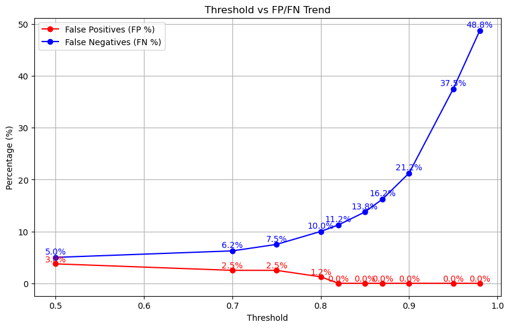
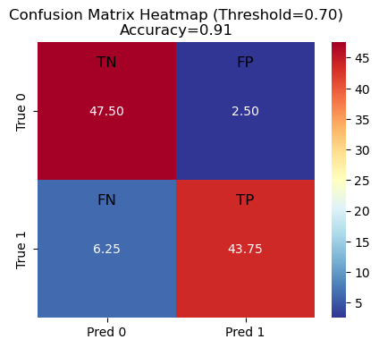
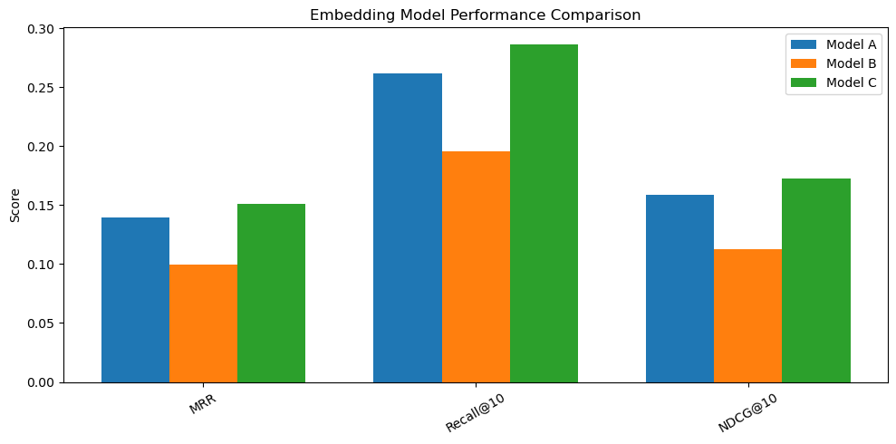
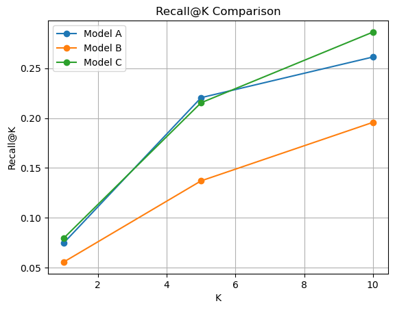
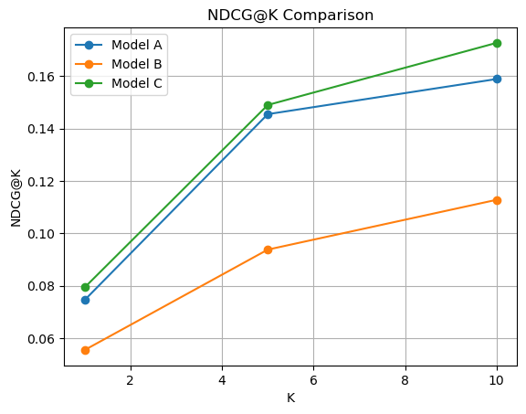
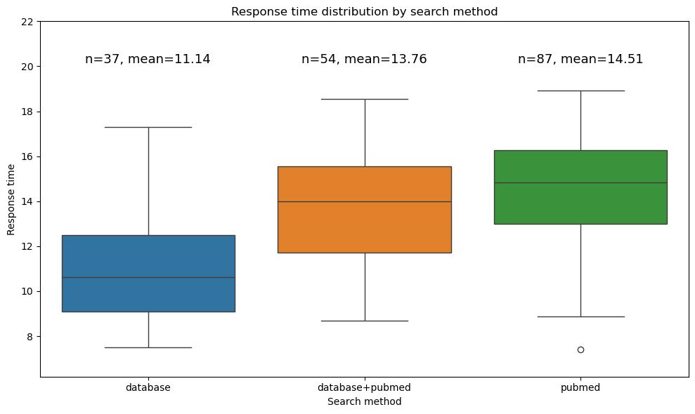

# Biomedical RAG System: Technical Overview

## 1. Introduction & Motivation

In the rapidly evolving biomedical field, people face massive "information overload." Traditional search engines (e.g., PubMed) provide links but lack synthesis, while general-purpose LLMs often suffer from "hallucinations" when dealing with specialized medical data.

This project implements a **Retrieval-Augmented Generation (RAG)** system designed to bridge this gap. It combines the reliability of authoritative biomedical literature with the synthesis capabilities of LLMs, ensuring answers are grounded in factual data while remaining accessible via a user-friendly interface (LINE Bot).

## 2. System Architecture

The system follows a strict pipeline designed for **safety**, **efficiency**, and **accuracy**.

  

### 2.1. Input Processing

Initial filtering and processing of user input:

* Supports Text and Audio (via OpenAI Whisper)

* Filters excessively long messages (audio >15 seconds, text >150 characters)

* Language Detection (langdetect) & Translation (Google Translator) converts all queries to English for optimal retrieval performance

---

### 2.2. Security Gate (Filtering)

Strict filtering to reject non-biomedical queries:

* A local Binary Classifier determines if the query is "Biomedical" or "Non-Biomedical"

* Rejects irrelevant queries (e.g., stock prices, weather) immediately to save costs

* Non-biomedical queries are further classified via API to provide friendly responses (greetings, company-specific questions) (Optional)

---

### 2.3. Intelligent Caching

Checks the vector database for historically similar queries. If at least two historical records meet the following conditions, the system randomly returns one to the user:

* Query similarity > 0.85

* Answer similarity > 0.65

* Recorded in database within one year

---

### 2.4. Keywords Extraction

Uses API to extract keywords from user queries, enabling the following processing on original content to improve retrieval efficiency:

* Corrects typos in user queries

* Extends parts of speech and proper nouns

* Extracts key keywords from longer content

---

### 2.5. Hybrid Retrieval

Multi-stage article retrieval process to improve response speed:

**Stage 1 (Local):** Searches the local MySQL database for previously fetched articles that meet the following conditions (faster speed):

* Contains keywords

* Similarity with query > 0.3

* Recorded in database within one year

**Stage 2 (Web):** Falls back to NCBI PubMed API if local data is insufficient (default < 3 articles). Newly fetched articles are stored in the local MySQL database for future use.

* Articles from the past 3 years

* Default search returns 5 articles (reduces retrieval time)

---

### 2.6. Answer Generation

* GPT-4o-mini synthesizes the answer using the top 1-3 retrieved articles (number of articles determined by query complexity and article similarity)

* Output is translated back to Traditional Chinese with a professional yet accessible tone

## 3. Key Technical Components

### 3.1. Security Gate: The Binary Classifier

A local **Logistic Regression** classifier was later trained for better accuracy and cost saving. 

* **Input:** Sentence Embeddings (768-dim) from the fine-tuned model

* **Training Data:** 1,200 labeled pairs (Biomedical vs. General/Chit-chat)

* **Performance:**

    * **Accuracy:** ~91%

    * **False Positive Rate:** < 2.5%

    * **Latency:** < 0.05s (vs. 1-2s for GPT-based classification).

    * **Strategy:** A strict probability threshold (default 0.70) ensures only high-confidence biomedical queries trigger the RAG pipeline

    <table>
      <tr>
        <td width="60%" align="center">
           
          <b>Threshold vs FP/FN Trend</b> 
        </td>
        <td width="40%" align="center">
           
          <b>Confusion Matrix Heatmap</b> 
        </td>
      </tr>
    </table>

---

### 3.2. Embedding Model Fine-Tuning

I implemented a two-stage fine-tuning process to progressively adapt the model to the biomedical domain. 

**Base Model (Model A):** pritamdeka/BioBERT-mnli-snli-scinli-scitail-mednli-stsb

**Phase 1 (Model B):** Warm-up

* **Dataset:** 2,400 Q&A pairs (locally generated)

* **Loss Function:** CosineSimilarityLoss

* **Design choice:** Negative similarity labels were softened to 0.2 avoid over-penalizing partially relevant biomedical examples

    This stage focuses on **semantic stabilization** and **domain alignmentrather** than immediate metric improvement.

**Phase 2 (Model C):** Optimization

* **Dataset:** Kaggle Cancer Q&A Dataset (32,812 pairs)

* **Loss Function:** MultipleNegativesRankingLoss

    This contrastive training stage improves **retrieval ranking and separation** by leveraging dynamic in-batch negatives.

**Evaluation:** 

* **Test dataset:** BioASQ

* **Metrics:** MRR, Recall@K, NDCG@K

* **Results**

    <table>
      <tr>
        <td width="40%" align="center">
           
          <b>Embedding Model Performance Comparison</b> 
        </td>
        <td width="30%" align="center">
           
          <b>Recall@K Comparison</b> 
        </td>
        <td width="30%" align="center">
           
          <b>NDCG@K Comparison</b> 
        </td>
      </tr>
    </table>

    | **Metric** | **A.** Base | **B.** Phase 1 | **C.** Phase 2 (Final) | **Improvement (A→C)** |
    | :--- | :--- | :--- | :--- | :--- |
    | **MRR** | 0.1394 | 0.0993 | 0.1509 | **+8.3%** |
    | **Recall@10** | 0.2613 | 0.1957 | 0.2863 | **+9.6%** |
    | **NDCG@10** | 0.1589 | 0.1128 | 0.1727 | **+8.7%** |

    Compared to the base model (Model A), the final embedding model (Model C) achieved notable relative improvements on BioASQ, including **+8.3% in MRR**, **+9.6% in Recall@10**, and **+8.7% in NDCG@10**, indicating more effective ranking of relevant biomedical documents.

---

### 3.3. Hybrid Search Strategy

To balance speed and coverage, the system employs a two-tier search:

* **Tier 1:** Local Database (MySQL)

    Retrieves articles stored from previous queries.

    * **Speed:** <1 seconds.

    * **Condition:** Returns articles if they contain keywords, have similarity ≥ 0.30, and were recorded in database within one year

* **Tier 2:** PubMed API (NCBI E-utilities)

    Triggered only if local results are insufficient (<3 articles). Newly fetched articles are stored in the local database for future use.

    * **Optimization:** Uses ThreadPoolExecutor (max_workers=5) to parallelize embedding generation for fetched articles

    * **Speed:** ~2-4 seconds (Network dependent)

Using database retrieval reduces the overall time required for the RAG pipeline.

  

---

### 3.4. Dynamic Article Selection

The system dynamically decides how many articles to feed into the LLM context window based on query complexity:

**1 Article:** If the top article match has high similarity (≥ 0.70) or the query is simple

**3 Articles:** If the query contains complex terms (e.g., "mechanism", "meta-analysis", "pathogenesis")

**2 Articles:** Default case

---

### 3.5. Intelligent Caching Mechanism

To reduce API latency and costs, I implemented a vector-similarity based cache.

**Query Cache:** Stores the embedding and other information of every processed user query in MySQL database

**Hit Condition:** 

* New query vector $\approx$ historical query vector (Similarity ≥ 0.85)

* Answer Relevance of the cached record was high (≥ 0.65)

    If at least two historical answers meet both conditions above, the system randomly selects one to return to the user, providing more diverse response content.

**Performance Impact:** Cache hits reduce response time from 10-15s down to ~1s

   

## **4. Performance Metrics**

Based on testing:

| Metric | Value | Notes |
| :--- | :--- | :--- |
| Average Response Time (Cold) | 10-15s | Full pipeline (Preprocessing → Search → Generate) |
| Average Response Time (Warm) | ≤ 1s | Cache Hit |
| Classifier Accuracy | ~91% | Local binary classification |
| False Positive Rate | < 2.5% | Successfully filters greeting/spam | 
| Embedding Model Improvement | +8-9% | MRR, Recall@10, NDCG@10 vs. base model |

## **5. Future Enhancements**

* **Data Source Expansion:** Integrate full-text databases like PMC or bioRxiv to go beyond abstract-only retrieval

* **Enhanced Search:** Implement hybrid BM25 + semantic search for better keyword matching

* **Proactive Caching:** Periodically crawl articles for trending keywords during off-peak hours to improve response speed

* **Automated Evaluation:** Implement "Citation Consistency Checks" to automatically verify if the LLM's answer is supported by the retrieved text

* **Personalization:** Add user-specific context history (multi-turn conversation support), as the system is currently stateless

## **6. Technical Stack**

* **Backend:** Python, Flask

* **Database:** MySQL (articles, queries, cache)

* **NLP/ML:** sentence-transformers, scikit-learn, langdetect

* **APIs:** OpenAI (Whisper, GPT-4o-mini), Google Translate, NCBI E-utilities

* **Interface:** LINE Messaging API

---

*This project was developed as part of the Semiconductor AI & ChatGPT Application Course at NYCU-LIghtmed Laser System Research Center.*
