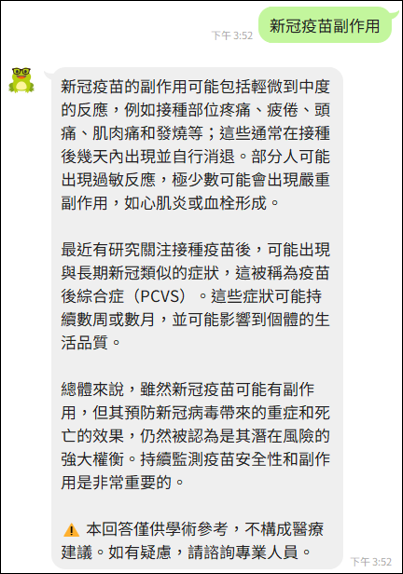
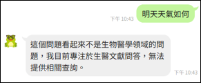
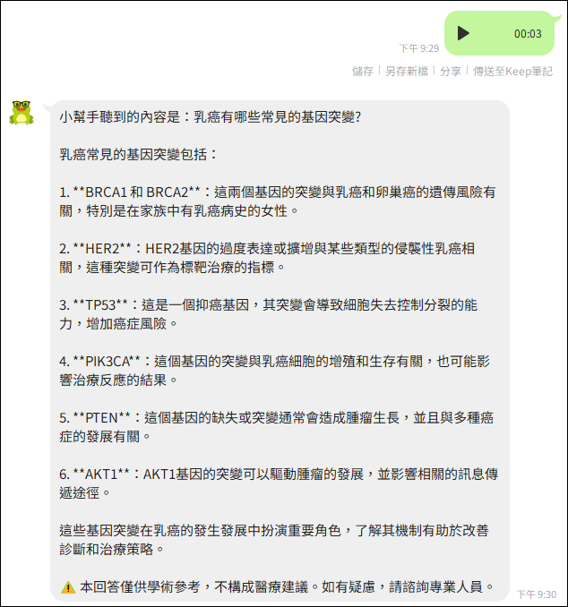
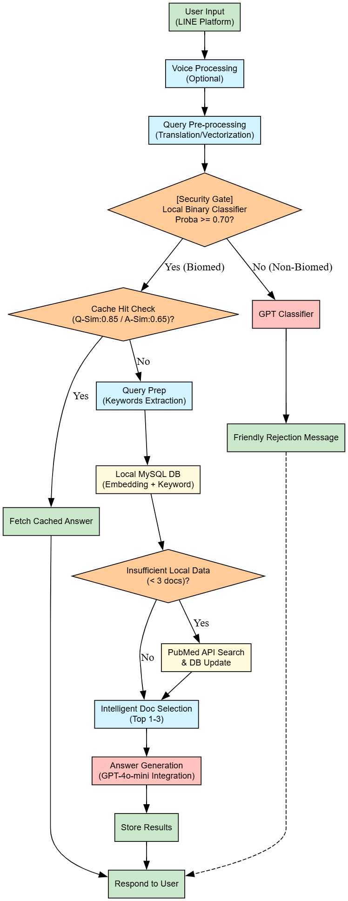

# Biomedical RAG System

**Portfolio Project** | NYCU-LIghtmed Laser System Research Center - STEM Training Program

A specialized Retrieval-Augmented Generation (RAG) system designed for biomedical literature. This project features a custom two-stage fine-tuned embedding model, a multi-tier hybrid search strategy, and a local security gate to ensure accurate and cost-effective query handling.

> **Detailed Documentation**: See [PROJECT_OVERVIEW.md](PROJECT_OVERVIEW.md) for architecture details, model fine-tuning methodology, and performance analysis.

## Core System Highlights

The value of this project lies in its engineered RAG pipeline, ensuring **safety**, **efficiency**, and **domain accuracy**.

| Feature | Description | Technical Implementation |
| :--- | :--- | :--- |
| **Security Gate** | **Critical LLM protection.** A local, pre-trained **binary classifier** filters out non-biomedical or general before API calls, saving cost and ensuring domain focus. | `scikit-learn` (Logistic regression), Fine-tuned embedding |
| **Domain-Specific Search** | Utilizes a **fine-tuned sentence transformer** on biomedical corpus for superior semantic retrieval accuracy, surpassing general-purpose embeddings in the target domain. | `sentence-transformers` with BioBERT base |
| **Hybrid Search** | Combines fast retrieval from a **local MySQL database** with real-time supplementation from the **NCBI PubMed API** (via E-utilities) to maximize information coverage. | `pymysql`, `requests`, Keyword extraction (GPT-4o-mini) |
| **Intelligent Caching** | Implements **vector-similarity query caching** (`queries` table). If a new query's vector is highly similar to a past query, the historical answer is returned instantly (response time ≤ 1s). | Cosine similarity, `queries` table |
| **Multi-Language Support** | Automatically translates user input to **English** for better retrieval (PubMed focus) and generates answers in **Traditional Chinese**. | `langdetect`, `deep-translator` |
| **Text and Audio Support** | Accepts voice messages via LINE Bot with duration validation | `ffmpeg`, `Whisper` |

## System Demo

### Biomedical Question Answering

<div align="center">
  
  <p><i>User asks about biomedical questions → System provides comprehensive answer with disclaimer</i></p>
</div>

---

### Intelligent Input Processing

<table>
  <tr>
    <td width="25%">
      <br>
      <b>Security Gate</b><br>
      <i>Filters non-biomedical queries<br>(e.g., weather, stock prices)</i>
    </td>
    <td width="25%">
      <br>
      <b>Voice Input</b><br>
      <i>Whisper STT converts speech<br>to text automatically</i>
    </td>
    <td width="25%">
      <br>
      <b>Input Validation</b><br>
      <i>Handles overly<br>long messages</i>
    </td>
    <td width="25%">
      <br>
      <b>Cached Response</b><br>
      <i>Similar queries answered<br>in 1 second</i>
    </td>
  </tr>
</table>

---

### Key Features Demonstrated:

* Biomedical Q&A with medical disclaimers

* Security gate achieves 91% accuracy (FP rate < 2.5%)

* Multi-modal support (text + voice messages)

* Intelligent caching reduces response time by 90%

## System Architecture

This diagram illustrates the multi-stage RAG pipeline:

<div style="text-align: center;">
  
</div>

## Tech Stack & Dependencies

**Core Technologies:**
* **Language**: Python 3.8+
* **ML/NLP**: `sentence-transformers`, `scikit-learn`, `joblib`
* **Database**: MySQL 8.0+
* **APIs**: OpenAI (GPT-4o-mini, Whisper), NCBI PubMed E-utilities
* **Web Integration**: Flask, LINE Bot SDK (Optional)

**Key Libraries:**
```
openai>=1.12.0
sentence-transformers>=2.2.0
pymysql>=1.1.0
scikit-learn>=1.3.0
flask>=2.3.0
```

## Getting Started

### Prerequisites

* Python 3.8+
* MySQL 8.0+
* An OpenAI API Key
* (Optional) LINE Bot credentials for webhook integration

### Setup Steps

1.  **Clone the repository**
    ```bash
    git clone https://github.com/YuChiHsuan/biomedical-rag.git
    cd biomedical-rag
    ```

2.  **Install dependencies**
    ```bash
    pip install -r requirements.txt
    ```

3.  **Configure Environment**
    ```bash
    cp .env.example .env
    # Edit .env with your DB credentials and API keys.
    # (Optional) LINE_CHANNEL_SECRET, LINE_CHANNEL_ACCESS_TOKEN
    ```

4.  **Initialize Database Structure**
    ```bash
    # Run the SQL schema to create the 'articles' and 'queries' tables.
    mysql -u [your_user] -p [your_db_name] < schema.sql
    ```

5.  **Download Pre-trained Models**
    
    > **Quick Start:** System works with base model. Download fine-tuned model for better improvement.

    Due to file size constraints, trained models are hosted separately:
    
    **Download Link:** [Google Drive - Biomedical RAG Models](https://drive.google.com/file/d/1h9MxH5qVisOiphCEEe6WA9pFu7IzFiw9/view?usp=sharing)

    The archive contains:

    * `biomedical-rag-finetuned/` - Fine-tuned embedding model directory

    * `binary_classifier_finetuned.pkl` - Security gate classifier

    ```bash
    # After downloading, extract to project root:
    unzip biomedical-rag-models.zip -d ./
    
    # Verify structure:
    # biomedical-rag/
    # ├── biomedical-rag-finetuned/
    # └── binary_classifier_finetuned.pkl
    ```

## Usage

### Command-Line Demo

Test the RAG system with built-in questions:

```bash
python biomedical_rag.py
```

### Module Integration

```python
from biomedical_rag import BiomedicalRAGBot

# Initialize bot (loads models and connects to DB)
bot = BiomedicalRAGBot()

# Ask a question
answer, top_articles, confidence, answer_relevance, total_time = bot.answer_question(
    "新冠肺炎疫苗有什麼副作用"
)

print(f"Answer: {answer}")
print(f"Response time: {response_time:.2f}s")

# Clean up
bot.close()
```
### LINE Bot Integration (Optional)

```bash
# Set LINE credentials in .env
python line_webhook.py
```

We can now interact with the RAG system via LINE messaging app! ;)

---

## Performance & Results

| Metric | Result | Note |
| :--- | :--- | :--- |
| **Response Time (Full)** | 10-15s | Complete RAG pipeline |
| **Response Time (Cached)** | ≤ 1s | Similar query retrieval |
| **Security Gate Accuracy** | 91% (FPR < 2.5%) | Filters non-biomedical queries |
| **Fine-tuning Improvement** | +8-9% | MRR/Recall/NDCG vs. base model |

## Project Structure

```
biomedical-rag/
├── biomedical_rag.py               # Core RAG implementation
├── line_webhook.py                 # LINE Bot webhook (optional)
├── requirements.txt                # Project dependencies
├── schema.sql                      # Database structure definition
├── .env.example                    # Environment variables template
├── .gitignore                      # Git ignore rules
├── README.md                       # This file
├── PROJECT_OVERVIEW.md             # Technical deep dive
├── LICENSE                         # MIT License
├── binary_classifier_finetuned.pkl # Security classifier (download separately)
├── biomedical-rag-finetuned/       # Fine-tuned embedding model (download separately)
└── images/                         # Demo images and videos
```

## Discussion

### Areas for Improvement

**1. Enhanced Retrieval**

* **Full-Text Integration:** Extend beyond PubMed abstracts to include full-text articles from PMC (PubMed Central) and preprint servers (bioRxiv, medRxiv)

* **Hybrid BM25 + Semantic Search:** Combine keyword-based BM25 with semantic embeddings for improved recall on technical terminology

* **Proactive Caching:** Implement scheduled crawling of trending biomedical topics during off-peak hours to preload high-demand articles

**2. Model Improvements**

* **Automated Evaluation Pipeline:** Implement citation consistency checks to verify LLM outputs against retrieved sources, reducing hallucination risk

* **Multi-Model Ensemble:** Test Claude/Gemini alongside GPT for answer generation, selecting based on query complexity

* **Dynamic Re-ranking:** Apply cross-encoder models for final article ranking before LLM synthesis

**3. User Experience**

* **Multi-Turn Conversations:** Add conversation context management for follow-up questions (currently stateless)

* **Source Attribution:** Display specific article sections supporting each claim in the generated answer

* **Confidence Visualization:** Provide users with transparency about retrieval quality and answer certainty

**4. Safety & Reliability**

* **Medical Disclaimer Enhancement:** Implement query-specific disclaimers based on detected topics (e.g., stronger warnings for treatment questions)

* **Bias Detection:** Monitor and flag potentially biased or outdated medical information in retrieved articles

* **Feedback Loop:** Allow users to rate answer quality, feeding data back into model fine-tuning

---

### Open Questions & Trade-offs

**1. Performance vs. Cost**

Current average response time (10-15s) prioritizes accuracy over speed.

**Potential optimizations:**

* **Proactive caching**: Pre-fetch trending topics → reduce cold start latency

* **Smaller models / fewer articles** → might sacrifice answer quality

**Trade-off:** Proactive caching adds infrastructure complexity but preserves accuracy

**2. Cache Strategy Optimization**

**Current approach:** Store all queries indefinitely in MySQL
    
**Challenge:** How to implement cache eviction without losing valuable historical data?

**Options:** 

* **LRU (Least Recently Used):** Keep most recent N queries

* **TTL (Time To Live):** Auto-expire old entries after 1 year

* **Popularity-based:** Retain only frequently accessed queries

**3. Domain Boundary Handling**

* The 91% security gate accuracy still allows ~2.5% false positives. Should we implement a human-in-the-loop review for edge cases?

* How to handle borderline queries that are partially biomedical (e.g., "nutrition and exercise for cancer patients")?

**4. Scalability Challenges**

* Local MySQL database grows with usage. Migration to vector databases (Pinecone, Weaviate) needed for >100K articles.

* Parallel user handling: Current design assumes single-user; multi-tenant support requires queue management and resource pooling.

---

### Research Directions

If continued as a research project:

* **Benchmark Analysis:** Compare performance against commercial medical Q&A systems (e.g., Google Health)

* **Cross-Lingual Retrieval:** Test retrieval performance for non-English medical literature

* **Domain Transfer:** Evaluate how well the fine-tuning approach generalizes to other scientific domains (e.g., chemistry, genomics)

## License
This project is licensed under the MIT License - see [LICENSE](LICENSE) file for details.

## Acknowledgments

**Course Information:**
- NYCU-LIghtmed Laser System Research Center
- STEM and Sustainable Development Training Program
- Course: Semiconductor AI & ChatGPT Applications

**Data & Models:**
- Base model: [BioBERT-mnli-snli-scinli-scitail-mednli-stsb](https://huggingface.co/pritamdeka/BioBERT-mnli-snli-scinli-scitail-mednli-stsb)
- Training data: [Cancer Q&A Dataset](https://www.kaggle.com/datasets/gvaldenebro/cancer-q-and-a-dataset)
- Test data: [BioASQ Dataset](https://www.kaggle.com/datasets/maverickss26/bioasq-dataset)

**APIs & Libraries:**
- [OpenAI API](https://platform.openai.com/docs/) (GPT-4o-mini, Whisper)
- [NCBI E-utilities](https://www.ncbi.nlm.nih.gov/books/NBK25501/) (PubMed access)
- [LINE Messaging API](https://developers.line.biz/en/docs/messaging-api/)
- sentence-transformers, scikit-learn, and the open-source community

---

## Contact

For questions or suggestions:
- **Author**: Hsuan, Yu-Chi
- **Email**: samanthaxuan320@gmail.com
- **GitHub**: [@YuChiHsuan](https://github.com/YuChiHsuan)

---

## Academic Integrity Statement

This project is an original work created for academic purposes. The fine-tuned models and system design are my own contributions. Base models and datasets are properly attributed to their original creators. 

**Disclaimer**: This system is for educational and research purposes only. It does not provide medical advice and should not be used for diagnosis or treatment decisions.
